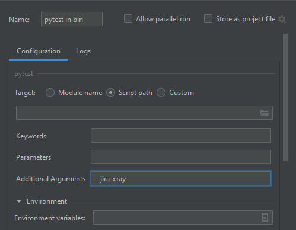
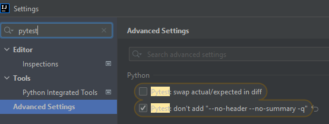

# pytest-jira-xray

[](https://pypi.python.org/pypi/pytest-jira-xray)
[](https://travis-ci.com/github/fundakol/pytest-jira-xray)
[](https://codecov.io/gh/fundakol/pytest-jira-xray)

pytest-jira-xray is a plugin for pytest that uploads test results to JIRA XRAY.

### Installation

```commandline
pip install pytest-jira-xray
```

or

```commandline
python setup.py install
```

### Usage

Mark a test with JIRA XRAY test ID

```python
# -- FILE: test_example.py
import pytest

@pytest.mark.xray('JIRA-1')
def test_one():
    assert True
```

### Jira Xray configuration can be provided via Environment Variables:

* Jira base URL:
```commandline
$ export XRAY_API_BASE_URL=<Jira base URL>
```
- Basic authentication:
```commandline
$ export XRAY_API_USER=<jria username>
$ export XRAY_API_PASSWORD=<user password>
```

- SSL Client Certificate

To disable SSL certificate verification, at the client side (no case-sensitive), default is True: 
```commandline
$ export XRAY_API_VERIFY_SSL=False
```

Or you can provide path to certificate file
```commandline
$ export XRAY_API_VERIFY_SSL=</path/to/PEM file>
```

* Cloud authentication:
```commandline
$ export XRAY_CLIENT_ID=<client id>
$ export XRAY_CLIENT_SECRET=<client secret>
```

* Test Execution parameters:
```commandline
$ export XRAY_EXECUTION_TEST_ENVIRONMENTS="Env1 Env2 Env3"
$ export XRAY_EXECUTION_FIX_VERSION="1.0"
```

### Upload results 

* Upload results to new test execution:
```commandline
$ pytest --jira-xray
```

* Upload results to existing test execution:
```commandline
$ pytest --jira-xray --execution TestExecutionId
```

* Upload results to existing test plan (new test execution will be created):
```commandline
$ pytest --jira-xray --testplan TestPlanId
```

* Use with Jira cloud:
```commandline
$ pytest --jira-xray --cloud
```

* Store results in a file instead of exporting directly to a XRAY server
```commandline
$ pytest --jira-xray --xraypath=xray.json
```

### IntelliJ integration

When you want to synchronize your test results via. Pytest integration in IntelliJ, you need to configure the following:

1. Use the *pytest* test configuration template and add `--jira-xray` to *Additional Arguments*
  
2. Disable `--no-summary` in *Settings*
  

### Troubleshooting

This section holds information about common issues.

#### `The Test XXX is in a non-executable status`
  * Problem: The test is not executable by the user.
  * Solution: Make sure, that your test is not deactivated, approved and ready to use in Jira.


## References

- XRay import execution endpoint: https://docs.getxray.app/display/XRAY/Import+Execution+Results
